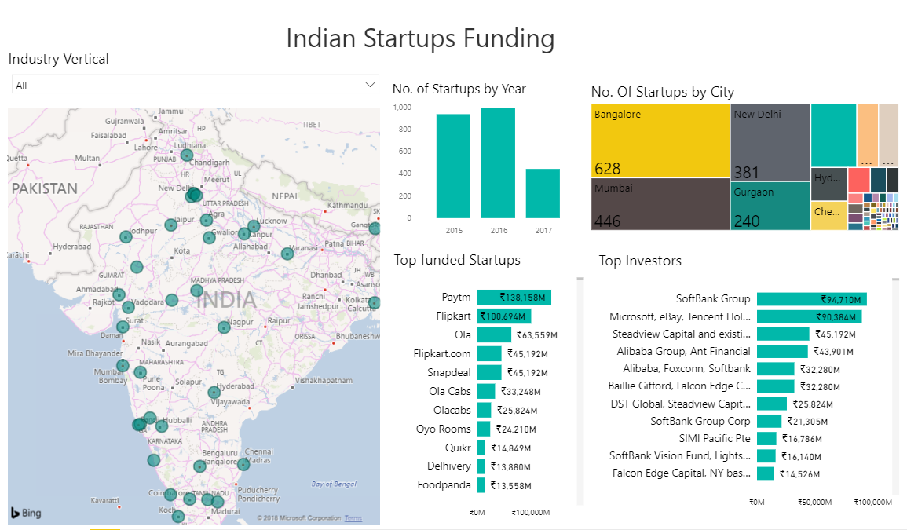

# Indian-Startups-Funding
Exploratory Data Analysis, Machine Learning and Data Visualization done on the Indian Startups Funding Dataset from Kaggle

Click
[here](https://www.google.com) for the Interactive version of the Dashbord made using Power BI

<iframe width="800" height="600" src="https://app.powerbi.com/view?r=eyJrIjoiOWIwODAyMTUtODhhZC00OTk5LWIxMWUtNGFhMTdjZmU4NDAxIiwidCI6IjE4NmE2ZTlkLTU0MjMtNGE3My1hNTUyLTRhZjY1N2VmNjZhNSIsImMiOjN9" frameborder="0" allowFullScreen="true"></iframe>
## To Be Done

- [x] Dashboard
- [ ] Exploratory Data Analysis
- [ ] Machine Learning
- [ ] Conclusions
